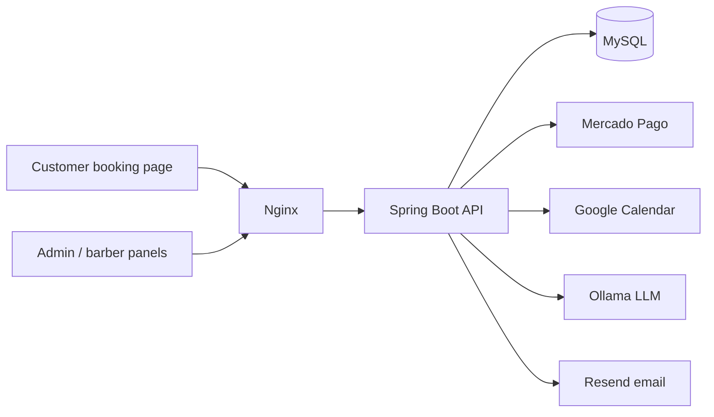
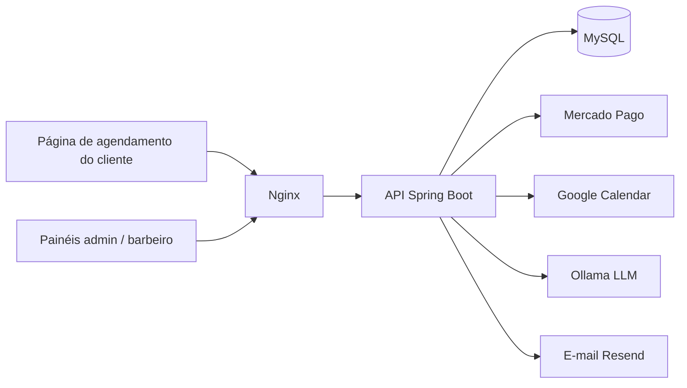

**[🇺🇸 English](#english)** · **[🇧🇷 Português](#português)**

# Agillis

Multi-tenant SaaS for barbershop management: online booking, schedule control, cash reports, and subscription billing.

**Live:** [agillis.app](https://agillis.app) · **Status:** in production with a paying customer (early stage)

> The source code is private. This page documents the architecture and the engineering decisions behind it. I'm happy to walk through the code on a call.

## What it does

Small barbershops usually run their schedule on WhatsApp and spreadsheets. Agillis gives the owner an admin panel, gives barbers their own agenda, and gives customers a public booking link (`agillis.app/agendar?t=<slug>`) where they pick a service, a barber, and a time slot.

## Architecture

- **Backend:** Java 21, Spring Boot 3, Spring Security, JPA/Hibernate, MySQL 8. 62 REST endpoints, 11 entities.
- **Frontend:** static HTML/CSS/vanilla JS on Vercel (no build step).
- **Delivery:** GitHub Actions deploys to an Oracle Cloud VPS with Docker Compose behind Nginx. Daily database backup with 14-day retention.
- **Tests:** around 86 unit tests (JUnit 5, Mockito) focused on the scheduling engine, weekly schedule rules, and the AI context builder.

## Engineering decisions

### 1. Tenant isolation
Every tenant-owned row carries a `tenant_id`, and every query receives it from the authenticated JWT, never from the request body. Services also check that referenced IDs (like a service or a barber) belong to the same tenant, so a crafted ID can't cross the boundary.

### 2. Double-booking under concurrency
Booking checks for conflicts using the **service duration** (a 60-minute cut starting at 10:00 blocks until 11:00), applies the tenant's buffer between services, and requires the service to **finish before closing time**. To keep two simultaneous requests from taking the same slot, the barber row is loaded with a **pessimistic write lock** (`SELECT ... FOR UPDATE`), which serializes bookings per barber.

### 3. Weekly schedule with inheritance
Each tenant has global opening hours, and any weekday can be overridden (closed or custom hours). The "closed" flag is checked before the hours, because a closed day is stored with empty hours and would otherwise look open. A regression test covers it.

### 4. Subscription billing with Mercado Pago
Payment webhooks are validated with an **HMAC-SHA256 signature** and processed **idempotently**: the last payment ID is stored, so a retried webhook can't extend the subscription twice. Unknown payments (simulator tests) return 200, while real upstream failures return 500 so the provider retries. A daily scheduled job sends renewal reminders in stages (5 days, 1 day, expired) with deduplication.

### 5. Self-hosted AI assistant
Owners can ask questions about their own business ("how was this month?"). A local LLM (Ollama) answers using only that tenant's data. Design choices:
- **Topic routing before querying:** the question is classified (agenda, revenue, services, clients, trends) and only the relevant data blocks are built.
- **Token budget:** context blocks have priorities and the lowest-priority ones are dropped first, so the rules never get cut off.
- **Two-layer cache** (prompt and answer, invalidated by content hash) and a **sliding-window rate limit per tenant**.
- **Failure handling:** 4xx from the model is permanent, 5xx is retried with exponential backoff, and the API returns 429/503 accordingly.

### 6. External failures never break the core flow
If Google Calendar sync, push notifications, or email fail, the booking itself still succeeds. Integrations are best-effort around the transaction, not part of it.

## Stack

Java 21 · Spring Boot 3 · Spring Security · JWT · JPA/Hibernate · MySQL · Docker Compose · Nginx · GitHub Actions · Mercado Pago · Google Calendar API (OAuth2) · Ollama · Resend

## Contact

Kelvin Kauan Pereira Lemos · [LinkedIn](https://linkedin.com/in/kelvinkauan) · [GitHub](https://github.com/kelvinlemos7) · kelvinkauan17@gmail.com

---

# Agillis (Português)

SaaS multi-tenant para gestão de barbearias: agendamento online, controle de agenda, relatórios de caixa e cobrança de assinatura.

**No ar:** [agillis.app](https://agillis.app) · **Status:** em produção com cliente pagante (fase inicial)

> O código-fonte é privado. Esta página documenta a arquitetura e as decisões de engenharia por trás dele. Fico à disposição para mostrar o código em uma conversa.

## O que faz

Barbearias pequenas costumam organizar a agenda no WhatsApp e em planilhas. O Agillis dá ao dono um painel administrativo, dá aos barbeiros a própria agenda e dá aos clientes um link público de agendamento (`agillis.app/agendar?t=<slug>`), onde escolhem serviço, barbeiro e horário.

## Arquitetura

- **Backend:** Java 21, Spring Boot 3, Spring Security, JPA/Hibernate, MySQL 8. 62 endpoints REST, 11 entidades.
- **Frontend:** HTML/CSS/JS puro estático na Vercel (sem etapa de build).
- **Entrega:** GitHub Actions faz o deploy em uma VPS Oracle Cloud com Docker Compose atrás de Nginx. Backup diário do banco com retenção de 14 dias.
- **Testes:** cerca de 86 testes unitários (JUnit 5, Mockito) focados no motor de agendamento, nas regras da grade semanal e no construtor de contexto da IA.

## Decisões de engenharia

### 1. Isolamento entre tenants
Toda linha que pertence a um tenant carrega um `tenant_id`, e toda consulta recebe esse valor do JWT autenticado, nunca do corpo da requisição. Os services também verificam se os IDs referenciados (como um serviço ou um barbeiro) pertencem ao mesmo tenant, então um ID forjado não atravessa a fronteira.

### 2. Double-booking sob concorrência
O agendamento verifica conflitos usando a **duração do serviço** (um corte de 60 minutos começando às 10:00 bloqueia até as 11:00), aplica o intervalo entre serviços do tenant e exige que o serviço **termine antes do fechamento**. Para impedir que duas requisições simultâneas ocupem o mesmo horário, a linha do barbeiro é carregada com um **lock pessimista de escrita** (`SELECT ... FOR UPDATE`), que serializa os agendamentos por barbeiro.

### 3. Grade semanal com herança
Cada tenant tem um horário de funcionamento global, e qualquer dia da semana pode ser sobrescrito (fechado ou com horário próprio). A flag "fechado" é verificada antes dos horários, porque um dia fechado é gravado com horários vazios e, de outra forma, pareceria aberto. Um teste de regressão cobre esse caso.

### 4. Cobrança de assinatura com Mercado Pago
Os webhooks de pagamento são validados com **assinatura HMAC-SHA256** e processados de forma **idempotente**: o ID do último pagamento é guardado, então um webhook reenviado não estende a assinatura duas vezes. Pagamentos desconhecidos (testes do simulador) retornam 200, enquanto falhas reais do provedor retornam 500 para que ele tente de novo. Um job diário agendado envia lembretes de renovação em estágios (5 dias, 1 dia, vencido), com deduplicação.

### 5. Assistente de IA self-hosted
O dono pode fazer perguntas sobre o próprio negócio ("como foi este mês?"). Um LLM local (Ollama) responde usando apenas os dados daquele tenant. Decisões de projeto:
- **Roteamento por assunto antes da consulta:** a pergunta é classificada (agenda, receita, serviços, clientes, tendências) e só os blocos de dados relevantes são montados.
- **Orçamento de tokens:** os blocos de contexto têm prioridades e os de menor prioridade são descartados primeiro, para que as regras nunca sejam cortadas.
- **Cache em duas camadas** (prompt e resposta, invalidados por hash do conteúdo) e **rate limit por janela deslizante por tenant**.
- **Tratamento de falhas:** 4xx do modelo é falha permanente, 5xx é repetido com backoff exponencial, e a API devolve 429/503 de acordo.

### 6. Falhas externas nunca quebram o fluxo principal
Se a sincronização com o Google Calendar, as notificações push ou o e-mail falharem, o agendamento em si continua funcionando. As integrações são feitas em melhor esforço ao redor da transação, e não dentro dela.

## Stack

Java 21 · Spring Boot 3 · Spring Security · JWT · JPA/Hibernate · MySQL · Docker Compose · Nginx · GitHub Actions · Mercado Pago · Google Calendar API (OAuth2) · Ollama · Resend

## Contato

Kelvin Kauan Pereira Lemos · [LinkedIn](https://linkedin.com/in/kelvinkauan) · [GitHub](https://github.com/kelvinlemos7) · kelvinkauan17@gmail.com
