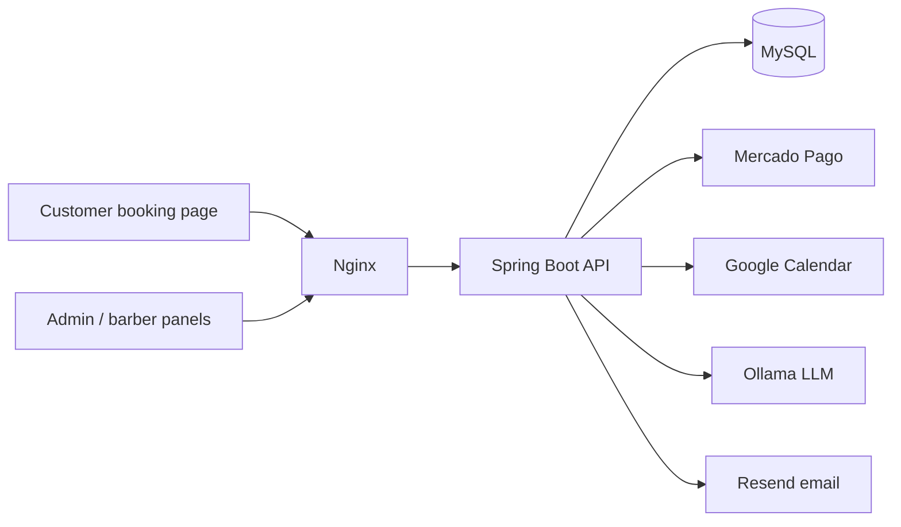

# Agillis

Multi-tenant SaaS for barbershop management: online booking, schedule control, cash reports, and subscription billing.

**Live:** [agillis.app](https://agillis.app) · **Status:** in production with a paying customer (early stage)

> The source code is private. This page documents the architecture and the engineering decisions behind it. I'm happy to walk through the code on a call.

## What it does

Small barbershops usually run their schedule on WhatsApp and spreadsheets. Agillis gives the owner an admin panel, gives barbers their own agenda, and gives customers a public booking link (`agillis.app/agendar?t=<slug>`) where they pick a service, a barber, and a time slot.

## Architecture

- **Backend:** Java 21, Spring Boot 3, Spring Security, JPA/Hibernate, MySQL 8. 62 REST endpoints, 11 entities.
- **Frontend:** static HTML/CSS/vanilla JS on Vercel (no build step).
- **Delivery:** GitHub Actions deploys to an Oracle Cloud VPS with Docker Compose behind Nginx. Daily database backup with 14-day retention.
- **Tests:** around 86 unit tests (JUnit 5, Mockito) focused on the scheduling engine, weekly schedule rules, and the AI context builder.

## Engineering decisions

### 1. Tenant isolation
Every tenant-owned row carries a `tenant_id`, and every query receives it from the authenticated JWT, never from the request body. Services also check that referenced IDs (like a service or a barber) belong to the same tenant, so a crafted ID can't cross the boundary.

### 2. Double-booking under concurrency
Booking checks for conflicts using the **service duration** (a 60-minute cut starting at 10:00 blocks until 11:00), applies the tenant's buffer between services, and requires the service to **finish before closing time**. To keep two simultaneous requests from taking the same slot, the barber row is loaded with a **pessimistic write lock** (`SELECT ... FOR UPDATE`), which serializes bookings per barber.

### 3. Weekly schedule with inheritance
Each tenant has global opening hours, and any weekday can be overridden (closed or custom hours). The "closed" flag is checked before the hours, because a closed day is stored with empty hours and would otherwise look open. A regression test covers it.

### 4. Subscription billing with Mercado Pago
Payment webhooks are validated with an **HMAC-SHA256 signature** and processed **idempotently**: the last payment ID is stored, so a retried webhook can't extend the subscription twice. Unknown payments (simulator tests) return 200, while real upstream failures return 500 so the provider retries. A daily scheduled job sends renewal reminders in stages (5 days, 1 day, expired) with deduplication.

### 5. Self-hosted AI assistant
Owners can ask questions about their own business ("how was this month?"). A local LLM (Ollama) answers using only that tenant's data. Design choices:
- **Topic routing before querying:** the question is classified (agenda, revenue, services, clients, trends) and only the relevant data blocks are built.
- **Token budget:** context blocks have priorities and the lowest-priority ones are dropped first, so the rules never get cut off.
- **Two-layer cache** (prompt and answer, invalidated by content hash) and a **sliding-window rate limit per tenant**.
- **Failure handling:** 4xx from the model is permanent, 5xx is retried with exponential backoff, and the API returns 429/503 accordingly.

### 6. External failures never break the core flow
If Google Calendar sync, push notifications, or email fail, the booking itself still succeeds. Integrations are best-effort around the transaction, not part of it.

## Stack

Java 21 · Spring Boot 3 · Spring Security · JWT · JPA/Hibernate · MySQL · Docker Compose · Nginx · GitHub Actions · Mercado Pago · Google Calendar API (OAuth2) · Ollama · Resend

## Contact

Kelvin Kauan Pereira Lemos · [LinkedIn](https://linkedin.com/in/kelvinkauan) · [GitHub](https://github.com/kelvinlemos7) · kelvinkauan17@gmail.com
